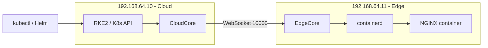

# KubeEdge Demo: Full Design and Installation Guide

This document describes the complete design and step-by-step installation for a KubeEdge demo: a Kubernetes cluster on the cloud (192.168.64.10), an edge node (192.168.64.11), and a Helm chart that deploys NGINX as the "server" container on the edge via containerd.

---

## Table of Contents

1. [Design Overview](#1-design-overview)
2. [Architecture](#2-architecture)
3. [Prerequisites](#3-prerequisites)
4. [Phase 1: Cloud Cluster (RKE2)](#4-phase-1-cloud-cluster-rke2)
5. [Phase 2: Edge Node Setup](#5-phase-2-edge-node-setup)
6. [Phase 3: KubeEdge Installation](#6-phase-3-kubeedge-installation)
7. [Phase 4: Helm Chart for NGINX Server](#7-phase-4-helm-chart-for-nginx-server)
8. [Phase 5: Deploy, Upgrade, and Uninstall](#8-phase-5-deploy-upgrade-and-uninstall)
9. [Verification](#9-verification)
10. [Summary Checklist](#10-summary-checklist)
11. [Known Issues and Gotchas](#11-known-issues-and-gotchas)

---

## 1. Design Overview

| Component | Role |
|-----------|------|
| **Cloud (192.168.64.10)** | RKE2 Kubernetes cluster + KubeEdge CloudCore. Control plane for scheduling and managing workloads. |
| **Edge (192.168.64.11)** | Ubuntu machine running EdgeCore and containerd. Runs the NGINX "server" container. |
| **Server** | NGINX container. Deploying the Helm chart brings up NGINX on the edge; uninstalling stops it. Uses **hostNetwork** to mimic NodePort—accessible at `http://192.168.64.11:80` directly. |

**Goal**: Use Kubernetes and Helm to deploy, upgrade, and stop the NGINX container on the edge node—not via local `docker` or `crictl` commands.

### hostNetwork Design

The NGINX pod uses `hostNetwork: true`, so it shares the edge node's network namespace. This mimics NodePort behavior without a Kubernetes Service:

- **Access**: `http://192.168.64.11:80` directly (or whatever port NGINX uses)
- **No Service needed**: The container port is exposed on the edge node's IP
- **Port**: Ensure port 80 (or chosen port) is free on the edge node

---

## 2. Architecture



**Flow**:

1. `helm install server ./server-chart` → Pod created in Kubernetes.
2. EdgeController syncs the pod spec to EdgeHub.
3. EdgeHub forwards to EdgeD on the edge node.
4. EdgeD pulls the NGINX image via containerd CRI and starts the container.
5. `helm uninstall server` → Pod deleted → EdgeD stops the NGINX container.
6. With **hostNetwork**: NGINX listens on the edge node's interface; access via `http://192.168.64.11:80`.

---

## 3. Prerequisites

### Cloud (192.168.64.10)

- Ubuntu 24.04 (or compatible)
- 2 CPU, 4 GB RAM minimum
- `curl` installed
- Firewall: ports 10000, 10002 open for edge nodes (CloudCore)

### Edge (192.168.64.11)

- Ubuntu 24.04 (or compatible)
- Network reachability to 192.168.64.10
- No kubelet/kube-proxy on the edge node

### Kubernetes Version

- **KubeEdge** supports Kubernetes 1.26–1.32 ([compatibility matrix](https://github.com/kubeedge/kubeedge#kubernetes-compatibility)).
- Use RKE2 v1.32.x (Kubernetes 1.32) for this demo.

---

## 4. Phase 1: Cloud Cluster (RKE2)

Install a single-node RKE2 cluster with Flannel CNI and no NGINX Ingress. See [rke2-rke2.1.34-single-node-ubuntu-24.04.md](rke2-rke2.1.34-single-node-ubuntu-24.04.md) for full details.

**Quick reference**:

```bash
# Create config
sudo mkdir -p /etc/rancher/rke2
sudo tee /etc/rancher/rke2/config.yaml << 'EOF'
cni: flannel
disable:
  - rke2-ingress-nginx
EOF

# Install RKE2 v1.32.8
curl -sfL https://get.rke2.io | sudo INSTALL_RKE2_VERSION="v1.32.8+rke2r1" sh -

# Start
sudo systemctl enable rke2-server.service
sudo systemctl start rke2-server.service

# Single-node: allow scheduling on control plane
kubectl taint nodes --all node-role.kubernetes.io/control-plane:NoSchedule-

# Configure kubectl
mkdir -p ~/.kube
sudo cp /etc/rancher/rke2/rke2.yaml ~/.kube/config
sudo chown $(id -u):$(id -g) ~/.kube/config
export PATH=/var/lib/rancher/rke2/bin:$PATH
```

---

## 5. Phase 2: Edge Node Setup

Install **containerd** and CNI plugins on the edge node. KubeEdge will use containerd to run the NGINX container.

**On 192.168.64.11**:

```bash
# 1. containerd
curl -fsSL https://github.com/containerd/containerd/releases/download/v1.7.18/containerd-1.7.18-linux-amd64.tar.gz | sudo tar -xzf - -C /
sudo systemctl enable --now containerd
containerd config default | sudo tee /etc/containerd/config.toml
# Ensure "cri" is NOT in disabled_plugins
# For KubeEdge: set systemdCgroup = false (or keadm join will fail with cgroupsPath error)
sudo sed -i 's/systemdCgroup = true/systemdCgroup = false/' /etc/containerd/config.toml
sudo systemctl restart containerd

# 2. CNI plugins
wget https://github.com/containernetworking/plugins/releases/download/v1.4.0/cni-plugins-linux-amd64-v1.4.0.tgz
sudo mkdir -p /opt/cni/bin
sudo tar -xzf cni-plugins-linux-amd64-v1.4.0.tgz -C /opt/cni/bin
```

**Note**: For ARM64, replace `linux-amd64` with `linux-arm64` in the URLs.

---

## 6. Phase 3: KubeEdge Installation

### 6.1 CloudCore (192.168.64.10)

```bash
# Install keadm
wget https://github.com/kubeedge/kubeedge/releases/download/v1.22.1/keadm-v1.22.1-linux-amd64.tar.gz
tar -xzf keadm-v1.22.1-linux-amd64.tar.gz
sudo cp keadm-v1.22.1-linux-amd64/keadm/keadm /usr/local/bin/

# Init CloudCore (advertise address must be reachable by edge)
keadm init --advertise-address="192.168.64.10" --kubeedge-version=v1.22.1 --kube-config=$HOME/.kube/config

# Verify
kubectl get pods -n kubeedge
```

Ensure firewall allows 192.168.64.11 to reach 192.168.64.10 on ports **10000** and **10002**.

### 6.2 EdgeCore (192.168.64.11)

```bash
# On 192.168.64.10: get token
keadm gettoken

# On 192.168.64.11: join edge node
keadm join --cloudcore-ipport=192.168.64.10:10000 --token=<PASTE_TOKEN_HERE> --kubeedge-version=v1.22.1 \
  --remote-runtime-endpoint=unix:///run/containerd/containerd.sock
```

Verify from the cloud:

```bash
kubectl get nodes
```

The edge node should appear as Ready with label `node-role.kubernetes.io/edge=""`.

---

## 7. Phase 4: Helm Chart for NGINX Server

Create a minimal Helm chart that deploys NGINX on the edge node with **hostNetwork** (NodePort-like access).

### Chart Structure

```
server-chart/
├── Chart.yaml
├── values.yaml
└── templates/
    └── deployment.yaml
```

### Chart.yaml

```yaml
apiVersion: v2
name: server-chart
description: Deploys NGINX server container on KubeEdge edge node (hostNetwork)
type: application
version: 0.1.0
appVersion: "1.25"
```

### values.yaml

```yaml
image:
  repository: nginx
  tag: alpine
  pullPolicy: IfNotPresent

nodeSelector:
  node-role.kubernetes.io/edge: ""

replicaCount: 1

# hostNetwork: mimics NodePort; access at http://<edge-node-ip>:80
hostNetwork: true
```

### templates/deployment.yaml

```yaml
apiVersion: apps/v1
kind: Deployment
metadata:
  name: server
  labels:
    app: server
spec:
  replicas: {{ .Values.replicaCount }}
  strategy:
    type: Recreate
  selector:
    matchLabels:
      app: server
  template:
    metadata:
      labels:
        app: server
    spec:
      hostNetwork: {{ .Values.hostNetwork }}
      dnsPolicy: ClusterFirstWithHostNet
      nodeSelector: {{- toYaml .Values.nodeSelector | nindent 8 }}
      containers:
        - name: nginx
          image: "{{ .Values.image.repository }}:{{ .Values.image.tag }}"
          imagePullPolicy: {{ .Values.image.pullPolicy }}
          ports:
            - containerPort: 80
```

- `strategy: Recreate` — **Required** with `hostNetwork`. The default `RollingUpdate` starts the new pod before stopping the old one; both cannot bind the same host port, so the new pod gets stuck in `FailedScheduling`.
- `hostNetwork: true` — Pod shares edge node network; NGINX listens on node IP.
- `dnsPolicy: ClusterFirstWithHostNet` — Cluster DNS resolution with host network.
- `nodeSelector` — Schedules pod on the edge node.

---

## 8. Phase 5: Deploy, Upgrade, and Uninstall

### Deploy NGINX on Edge

```bash
helm install server ./server-chart
```

### Upgrade (e.g. NGINX version)

```bash
helm upgrade server ./server-chart --set image.tag=1.25-alpine
```

### Restart NGINX on Edge

```bash
kubectl rollout restart deployment/server
```

This works because the Deployment uses `strategy: Recreate` — the old pod is terminated first, freeing port 80 before the new pod starts. To confirm the restart actually happened on the edge node, watch for the container ID to change:

```bash
# On the edge node (192.168.64.11) — open a second terminal
sudo watch crictl ps
```

### Uninstall (stop NGINX on edge)

```bash
helm uninstall server
```

This removes the Deployment and pod; EdgeD stops the NGINX container on the edge node.

---

## 9. Verification

### After KubeEdge install

```bash
kubectl get nodes
# Edge node should be Ready

kubectl get pods -n kubeedge
# CloudCore should be Running
```

### After Helm install

```bash
kubectl get pods -o wide
# NGINX pod should be on the edge node (192.168.64.11)

# From edge node, check containerd
sudo crictl ps
# NGINX container should be listed
```

### Test NGINX (hostNetwork)

With hostNetwork, no Service is needed. Access NGINX directly on the edge node:

```bash
curl http://192.168.64.11:80
```

---

## 10. Summary Checklist

| Step | Location      | Action |
|------|---------------|--------|
| 1    | 192.168.64.10 | Install RKE2 v1.32 with Flannel, no NGINX Ingress |
| 2    | 192.168.64.10 | Configure kubectl, remove control-plane taint |
| 3    | 192.168.64.11 | Install containerd + CNI plugins |
| 4    | 192.168.64.10 | `keadm init --advertise-address=192.168.64.10` |
| 5    | 192.168.64.11 | `keadm join` with containerd runtime endpoint |
| 6    | 192.168.64.10 | Create server-chart with NGINX + nodeSelector |
| 7    | 192.168.64.10 | `helm install server ./server-chart` |
| 8    | 192.168.64.10 | `helm upgrade` or `helm uninstall` as needed |

---

## 11. Known Issues and Gotchas

### Flannel DaemonSet CrashLoopBackOff on Edge Node

RKE2's Flannel CNI is a DaemonSet — Kubernetes schedules it on every node it knows about, including the edge. The edge node does not run kubelet, so the `kube-flannel-ds` pod will always CrashLoopBackOff there. This is expected and does not affect your workloads.

To suppress it, taint the edge node so cluster-level DaemonSets are not scheduled there:

```bash
kubectl taint nodes <edge-node-name> node-role.kubernetes.io/edge=:NoSchedule
```

Any workload you want on the edge must then add a matching toleration in its pod spec:

```yaml
tolerations:
  - key: "node-role.kubernetes.io/edge"
    operator: "Exists"
    effect: "NoSchedule"
```

### Eclipse Mosquitto Container on Edge

An `eclipse-mosquitto:1.6.15` container runs on the edge alongside your workloads. This is KubeEdge's internal MQTT broker — EdgeCore uses it as a local message bus between its components (EdgeHub, EdgeD, MetaManager). It is expected and should not be removed or modified.

### kubectl logs May Not Work for Edge Pods

The edge node does not run kubelet, so `kubectl logs` can be unreliable for pods on the edge. Use `crictl` directly on the edge node instead:

```bash
sudo crictl ps                  # list containers
sudo crictl logs <container-id> # view logs
```

---

## References

- [KubeEdge Documentation](https://kubeedge.io/docs/)
- [KubeEdge Kubernetes Compatibility](https://github.com/kubeedge/kubeedge#kubernetes-compatibility)
- [RKE2 Installation](https://docs.rke2.io/install/quickstart)
- [RKE2 Network Options (Flannel)](https://docs.rke2.io/networking/basic_network_options)
